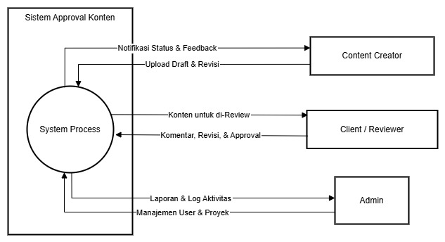
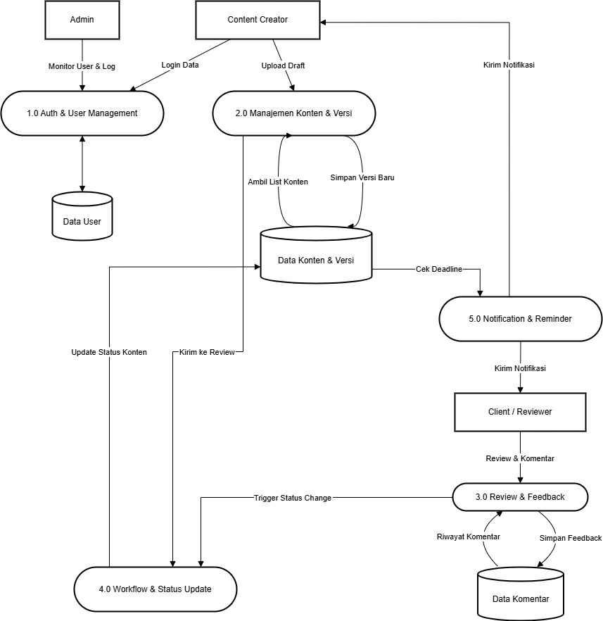
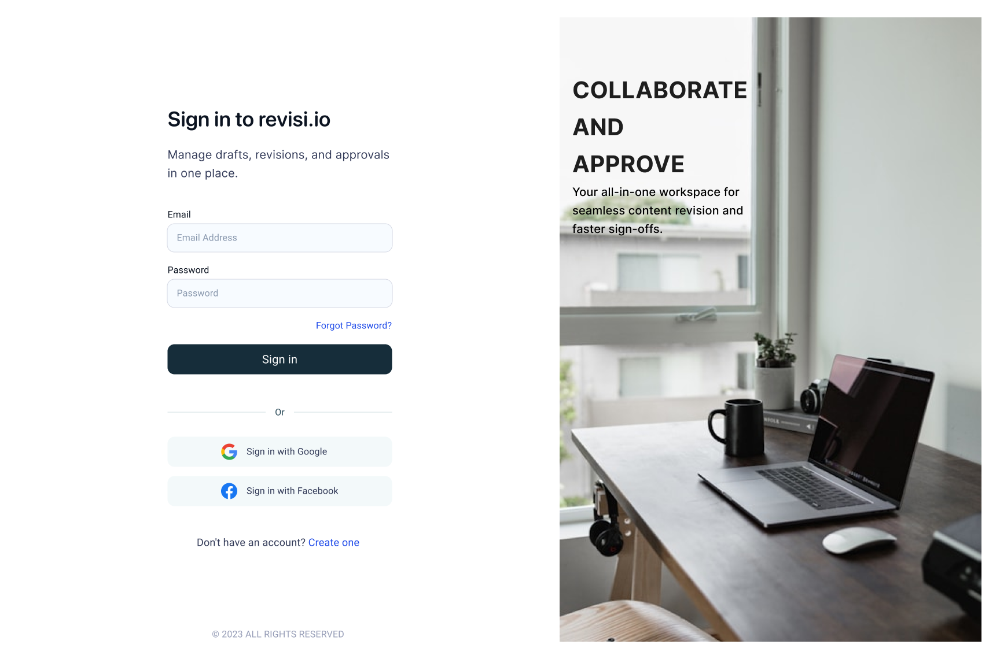
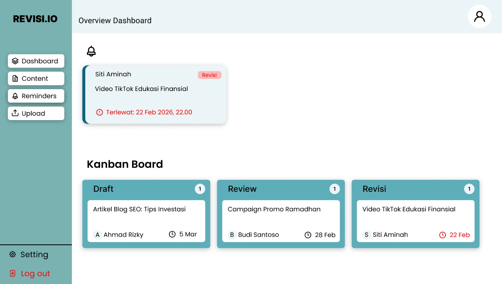
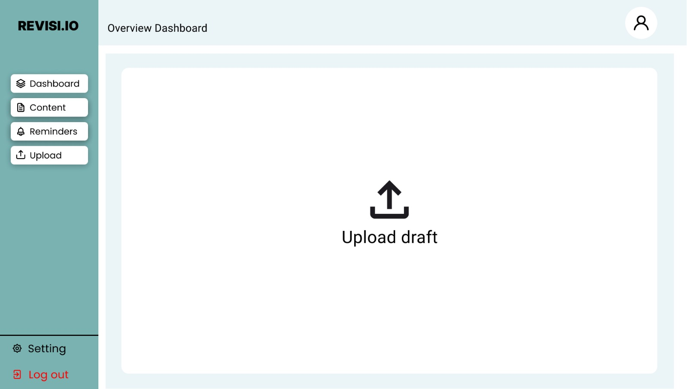

# TugasWeek_3

# 🚀 Tugas Besar: [REVISI.IO]

> **Dosen Pengampu:** Muhammad Shiddiq Azis, S.T., MBA

---

## 📊 Perancangan Sistem (DFD)

### DFD Level 0

*Diagram Konteks yang menunjukkan aliran data global.*

### DFD Level 1

*Detail proses bisnis dan integrasi database.*

---

## 🎨 Mockup Antarmuka
Rancangan UI aplikasi yang berfokus pada pengalaman pengguna.

| Login Page | Dashboard | Core Feature |
| :---: | :---: | :---: |
|  |  |  |

---

## 🛠️ Stack Teknologi
- **Frontend:** Next.js / Java Swing
- **Backend:** Node.js / Java 
- **Database:** PostgreSQL / MySQL

---

## 📂 Cara Instalasi
1. `git clone [url-repo]`
2. `npm install` (atau sesuaikan dengan environment)
3. `npm run dev`
